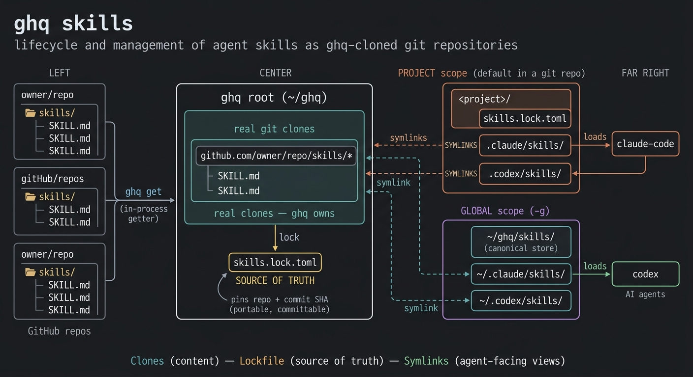

# ghq-skills

A fork of [`x-motemen/ghq`](https://github.com/x-motemen/ghq) that adds a
**`ghq skills`** subcommand: manage [agent skills](https://github.com/vercel-labs/skills)
the ghq way.

Every skill stays a **real git clone** under the ghq root, pinned by a lockfile
(`skills.lock.toml`) and symlinked into your agents' skills dirs. Unlike
`npx skills` — which packages content and records an md5 checksum — this keeps
full git history, so *"did upstream change?"* is a real `git fetch` + SHA compare,
and *"reproduce this exact set"* is a real commit pin.

> This is a superset of ghq: the same `ghq` binary, plus `ghq skills`. Base ghq
> commands (clone/list/get/root/…) are unchanged — see
> [upstream ghq](https://github.com/x-motemen/ghq#readme).



---

## Why

If you already use ghq to centralize repos, skills are just repos too. `ghq skills`
reuses ghq's own clone + path machinery **in-process** (no second binary, nothing
to install separately) and adds three things on top:

- a **lockfile** — the reproducible source of truth (repo + pinned commit), portable
  and committable;
- **scopes** — project (per-repo) by default, global with `-g`;
- **agent fan-out** — wire the same skills into `claude-code`, `codex`, … from one store.

## Install

Requires Go and `git`. `make install` builds and installs the **`ghq`** binary
(this fork = ghq + `ghq skills`) into `$GOBIN`, or `$(go env GOPATH)/bin` if unset.

**New users:**

```sh
git clone https://github.com/orca-studio/ghq-skills.git
cd ghq-skills
make install
```

**Existing ghq users** (dogfood ghq to fetch it):

```sh
ghq get github.com/orca-studio/ghq-skills
cd "$(ghq root)/github.com/orca-studio/ghq-skills"
make install
```

Then make sure the install dir (`$GOBIN` or `$(go env GOPATH)/bin`) is on your
`$PATH`. Because this binary *is* `ghq`, it replaces your existing ghq and adds the
`skills` subcommand — verify with `ghq skills --help`.

> Installed ghq via Homebrew? Homebrew's copy may shadow the freshly built one.
> Run `brew unlink ghq` so the Go-installed binary wins (revert with
> `brew link ghq`), or put the Go bin dir ahead of `/opt/homebrew/bin` on `$PATH`.

## Concepts

```
~/ghq/                                      # ghq root (GHQ_ROOT)
├─ github.com/<owner>/<repo>/...            # real clones (ghq owns)
│         └─ skills/foo/SKILL.md
└─ skills/                                  # GLOBAL store + global lockfile (no .git)
          ├─ skills.lock.toml
          └─ foo -> ../github.com/<owner>/<repo>/skills/foo

<project>/                                  # PROJECT scope (a git repo)
├─ skills.lock.toml                         # commit this — the project's SoT
├─ .claude/skills/foo -> ~/ghq/.../skills/foo
└─ .codex/skills/foo  -> ~/ghq/.../skills/foo
```

- **Clones** always land in the standard `~/ghq/...` tree (so `ghq list` sees them).
- **The lockfile is the source of truth.** Symlinks/agent dirs are derived from it.
- **The store dir has no `.git`**, so plain `ghq list` / `ghq rm` ignore it.

## Scope: project vs. global

`-g`/`--global` selects global; otherwise the **project** is used when you're inside
a git repo:

| | lockfile | skills materialize into | canonical store |
|---|---|---|---|
| **project** (default in a repo) | `<repo>/skills.lock.toml` | `<repo>/.claude/skills`, … | — |
| **global** (`-g`, or outside a repo) | `<ghq root>/skills/skills.lock.toml` | `~/.claude/skills`, … | `<ghq root>/skills/` |
| **`--lockfile <p>`** | `<p>` | agent dirs | `<p>`'s dir |

In project scope the repo root holds only the lockfile (commit it); skills wire
straight into the project's agent dirs. In global scope a canonical symlink store
also lives under `<ghq root>/skills` (override with `GHQ_SKILLS_ROOT`).

## Quick start

```sh
# Inside a project (project scope is the default):
ghq skills get larksuite/cli                 # clone, pick skills interactively, wire ./.claude/skills
ghq skills get larksuite/cli --all           # skip the picker: lock ALL its skills
ghq skills get larksuite/cli --skill lark-base --skill lark-doc   # only these
ghq skills get larksuite/cli --list          # enumerate skills, lock nothing
ghq skills list                              # what claude-code loads here
git add skills.lock.toml                     # commit the SoT for your team

# Personal / cross-project (global scope):
ghq skills get owner/repo -g                 # lock + wire into ~/.claude/skills
```

A source is `owner/repo` (ghq shorthand), a full URL, or an SSH remote. A repo may
hold many skills. Discovery prefers a Claude Code plugin manifest
(`.claude-plugin/plugin.json`) — the same source `npx skills` reads — and otherwise
walks the tree for `SKILL.md` (including category-nested layouts like
`skills/<category>/<name>/`). When several are found and you don't pass `--skill`
or `--all`, an interactive picker lets you choose (numbers or names); a
non-interactive stdin takes them all.

## Commands

| Command | Does |
|---|---|
| `get` (alias `add`) `<source>` | clone if needed, lock skills, wire agent dirs |
| `update [name]` | pull upstream, advance the lock, re-wire |
| `status` | show how far each locked skill has drifted behind upstream |
| `list` | skills wired into an agent's dir at the current scope (`-g` for global) |
| `manifest` | the canonical lockfile — the installed/pinned set |
| `lock` | check out each clone at its pinned commit |
| `restore` | clone + pin + wire the whole lockfile (fresh checkouts); `--wire-only` re-wires without clone/checkout |
| `rm` (alias `remove`) `<name>\|<source>…` | remove skills: drop their lockfile entries + symlinks — **never the clone** |

`rm` is the inverse of `get`'s *lock + wire* half, not its *clone* half: it deletes
the `[[skill]]` entries and the store/agent symlinks, but leaves the git clone under
`~/ghq/...` alone (sources are ghq's to manage — prune one with `ghq rm <owner>/<repo>`).
When you remove the last skill referencing a clone, it says so but won't delete it.
A typo'd argument aborts the whole call, so a removal never half-applies.

Each argument is a **skill name** or a **source** (`owner/repo`, URL) — mirroring
`get`. A source selects every locked skill from that repo; when several match and
stdin is a TTY, the same interactive picker as `get` lets you choose which to remove
(`--all/-A` removes them all; `--skill <name>` narrows by name):

```sh
ghq skills rm lark-base               # one skill by name
ghq skills rm larksuite/cli           # pick which of the repo's skills to drop
ghq skills rm larksuite/cli -A        # drop all of them
ghq skills rm larksuite/cli -s lark-base -s lark-doc   # just these
```

Common flags: `--skill <name>` (repeatable; `*`), `--all/-A` (take every skill, no picker),
`--subdir <path>`, `--lockfile <path>`, `-g/--global`, `-a/--agent`, `-y/--yes`.

### `list` vs `manifest`

- **`ghq skills list`** — what's *wired*: the skills physically in an agent's dir at
  one scope (project by default, global with `-g`, even inside a repo). `-a` picks
  agents. Shows even links not managed by ghq.
- **`ghq skills manifest`** — what's *installed/pinned*: the canonical lockfile,
  independent of which agent dirs are wired.

## Agents

`-a`/`--agent` chooses which agents' skills dirs to wire, at the current scope:

```sh
ghq skills get owner/repo               # default agent ($GHQ_DEFAULT_AGENT = claude-code)
ghq skills get owner/repo -a codex      # a specific agent (repeatable)
ghq skills get owner/repo -a all        # every $GHQ_SUPPORTED_AGENTS
ghq skills get owner/repo -a none       # lockfile only, no agent dirs
ghq skills restore --wire-only -a codex # wire already-locked skills into another agent
```

Config (env):

| Var | Default | Meaning |
|---|---|---|
| `GHQ_SUPPORTED_AGENTS` | `claude-code,codex` | agents for `-a all` |
| `GHQ_DEFAULT_AGENT` | `claude-code` | used when `-a` is omitted |
| `GHQ_AGENT_<NAME>` | built-in for the two above | that agent's **global** skills dir |
| `GHQ_AGENT_<NAME>_PROJECT` | built-in | that agent's **project** skills dir |

Built-ins: claude-code → `~/.claude/skills` / `.claude/skills`; codex →
`~/.codex/skills` / `.codex/skills`. Add any agent via its env vars + `GHQ_SUPPORTED_AGENTS`.

**Guardrail:** in project scope, if the agent's base dir (e.g. `.claude/`) is absent
in the current directory you're likely in the wrong place, so it prompts before
creating a new tree. It proceeds without asking when the base dir exists, with `-g`,
with `-y`, or on a non-interactive stdin (CI / scripted `restore` are never blocked).

## Team-shared project skills

The lockfile is portable (repo + pinned commit, no machine paths). Commit it; teammates
reproduce the exact set with `restore`:

```sh
# you, once — project scope is the default inside the repo:
ghq skills get larksuite/cli --skill lark-base --skill lark-doc
git add skills.lock.toml && git commit -m "pin agent skills"

# teammate, after cloning the project:
ghq skills restore
```

`restore` clones into the teammate's own ghq root, checks out the **pinned** commit
(never advancing it, unlike `update`), and wires their agent dirs. Commit the
**lockfile, not the symlinks** — the agent dirs point into each person's `~/ghq` and
are regenerated by `restore`:

```gitignore
# .claude/skills/.gitignore  (and .codex/skills/)
*
!.gitignore
```

## Design

`ghq skills` reuses ghq's own machinery in-process — the getter for cloning and
`LocalRepositoryFromURL` for path resolution — so there's no shelling out and no
second binary. All new code is additive:

- `cmd_skills.go` — the subcommand; the only touch to an existing file is one line
  registering `commandSkills` in `commands.go`.
- `agents.go` — agent registry, fan-out, scope-aware listing.
- `skills/` — self-contained package: lockfile, SKILL.md discovery, git helpers.

This keeps rebasing onto upstream trivial:

```sh
git fetch upstream
git rebase upstream/master      # additive changes rarely conflict
```
